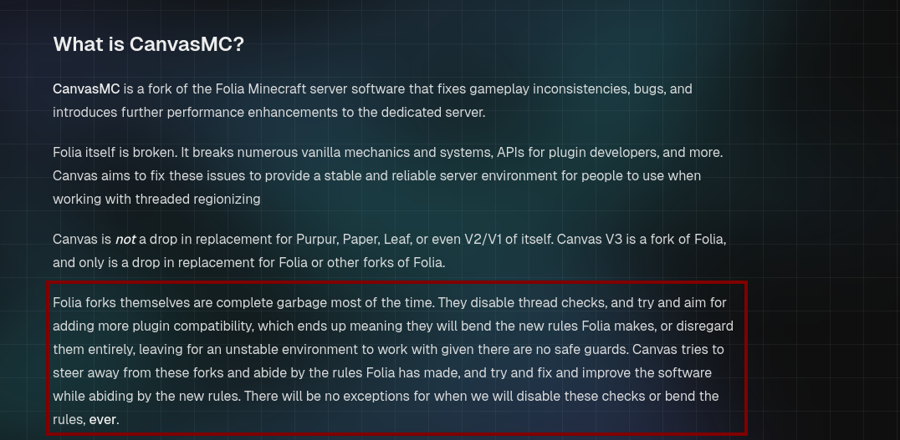

# Shiroha
A fork of luminol which includes the full functions which I want to add.

# Why create this fork ?
As luminol is being bigger and bigger, it is going to be considered the balance between performance in my mind, new features and vanilla features.
Also, the broken functions of Folia might have issues to be fixed and some needs completely rewrite which I won't do this on luminol because it might break the stability.
So as the result, we won't add back most of the broken functions of Folia instead of what Cavnas doin.

And to Canvas, they added bunch of wrong fixes and copied almost the whole fixes and some optimizations from Luminol and then announcing they are
the best one, which is totally immoral thing.

And you could also see what are hanging on their documents:

snapshot: https://web.archive.org/web/20251018101611/https://docs.canvasmc.io/

So this project also as uhm... but to be honest I cannot say it is a protest against Canvas, but I still need to implement the things I love to do because that would be my
hobbies just like what I am treating to Luminol.

# In this project what I wanna do
   - Add back the old rewritten scheduler of folia
   - Leaves protocol supports
   - Leaves fakeplayer supports
   - Laves replay api
   - Raytrace entity tracker(need to consider for twice)
   - Experimental optimizations
   - Virtual threads support
   - And more improved scheduling system

# Roadmap
This project doesn't have a clear roadmap at all.As we are ease to add the functions what I want, so I could change it anytime.